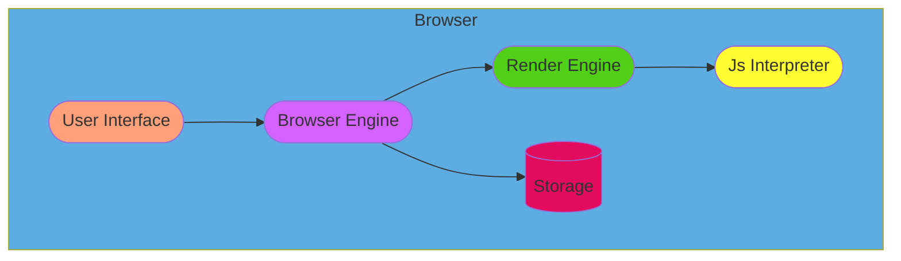
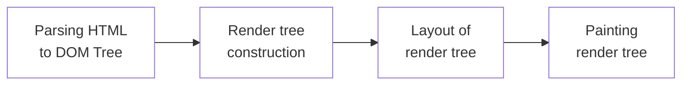
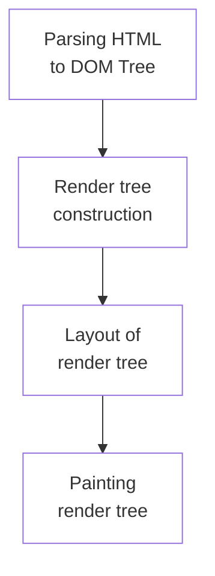
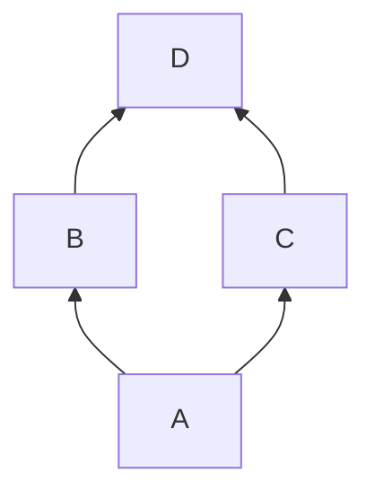

# Week 1 
### Exercise 1.1 (Working of Browser)

*I am ensuring that this project was done by me and not copied from anywhere.*

### *What is browser?*
A browser is a software where user can surf through internet and get the desired results. Browser is responsible for fetching the desired data and present it elegantly to the end user.
### *When an user enters an URL in the browser!*
- An URL is typed in a browser and called
- Browser search an Ip address for the domain
- Connection with the server is initiated
- Http request is sent to the server
- The request is processed by the server and sends the response
- Browser renders and display the content to the user 

### *Main functionality of the browser*
The main functionality of browser is, where user can search and surf. The browser displays the content elegantly and user can able to bookmark, manage the history etc.
### *High Level Components of a browser*

- #### User Interface
  - **Address bar**
    > Where user can enter the URL and direct search (Mordern browsers) 
  - **Back and Forward button**
    > Browser keeps track of the sites user visited, user can go back and forth using these options 
  - **Home button**
    > Its the main page of the browser where user can keep all sort of important things. It can be list of shortcuts for the favorite websites of user or a search engine page like Google, Duckduckgo etc. 
  - **Browser Window**
  - > This is where the browser renders the web content to the users it can be HTML, PDF, Audio, Video or any type of content.
  - **Settings** 
    > This is where the user keps thier personal preferences like browser theme, wether to save history or not, accounts and password etc.
- ####  Browser Engine
  > Browser engine is responsible for the interaction between User interface and Render engine
- #### Render Engine
  > Render engine is responsible for parsing the HTML and CSS files and displaying the webpage
- #### JS Interpreter
  > Render and parse the JS files for the websites
- #### Storage
  > Where keeps the data like Cookies, User accounts, Bookmarks, Files and other storage elements. 

#### *Rendering engine and its uses*
Render Engine is responsible for parsing the HTML and CSS file received from the server. The engine draws the structure and apply the design to it from the accquired file. There are number of engines currently used eg: Gecko, Blink
##### Flow of the Render tree

### *Parsers*
Parsing is one of the process of rendering engine. On parsing the document (HTML or CSS) translating the code and parse tree is generated. 

### *Script Processors*
### *Tree construction*
### *Order of script processing*
### *Layout and Painting*

